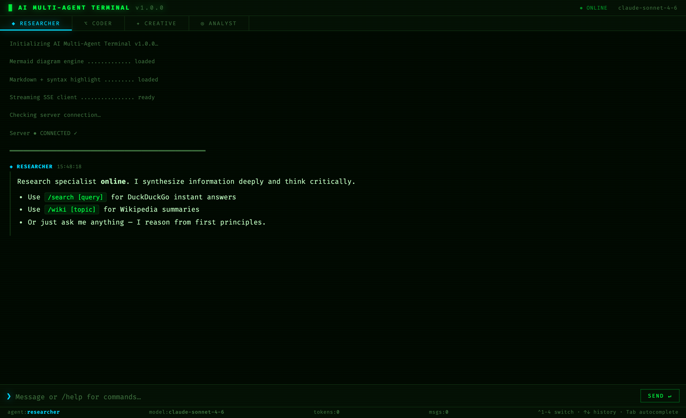
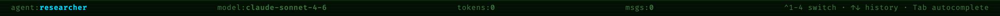
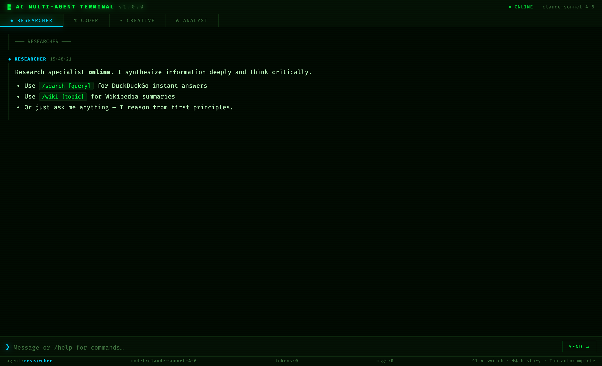
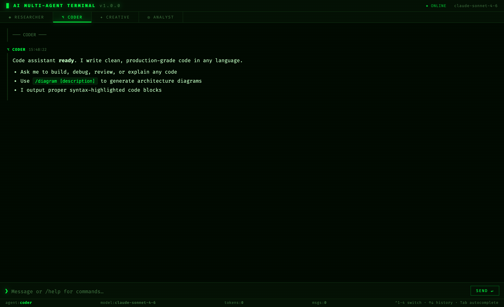
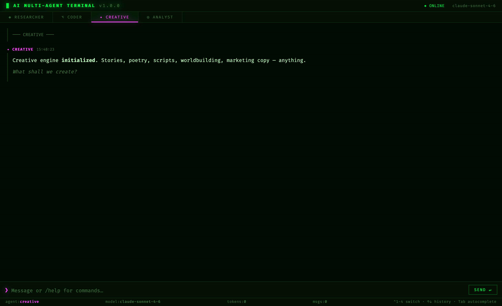
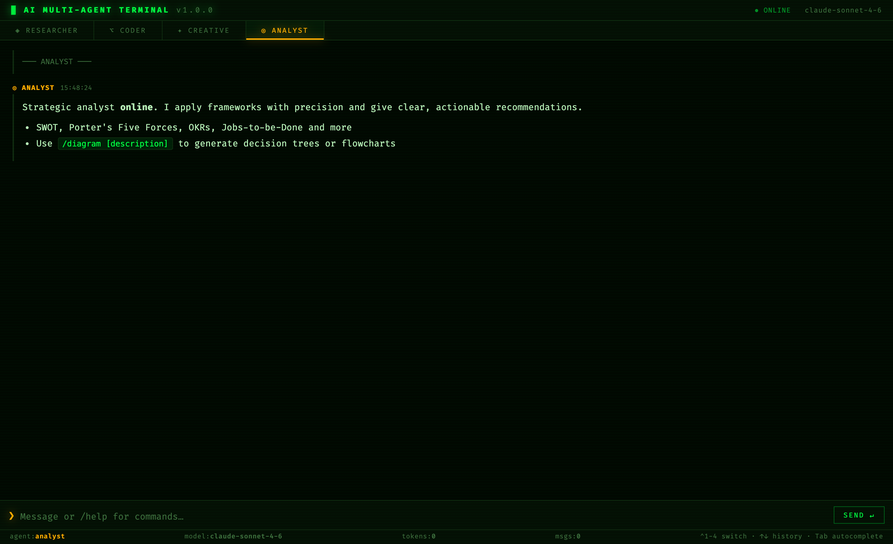
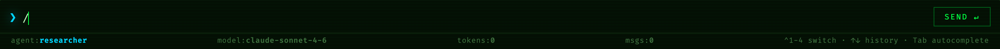

# AI MULTI-AGENT TERMINAL

> A hacker-aesthetic, browser-based terminal powered by the **Anthropic Claude API** — four specialised AI agents with independent conversation threads, live web search, Wikipedia lookup, Mermaid diagram generation, streaming responses, and a full command system.

---

## What it looks like



The terminal boots with a live startup sequence, confirms the server connection, and drops you straight into the active agent — all in a classic green-on-black monospace aesthetic with scanline overlay.

---

## UI Anatomy

The interface has four distinct zones:

```
┌─────────────────────────────────────────────────┐
│  HEADER   logo · connection status · model name  │
├─────────────────────────────────────────────────┤
│  TABS     ◈ RESEARCHER  ⌥ CODER  ✦ CREATIVE  ◎ ANALYST  │
├─────────────────────────────────────────────────┤
│                                                 │
│  CHAT WINDOW   (scrollable message history)     │
│                                                 │
├─────────────────────────────────────────────────┤
│  ❯  input field                      SEND ↵     │
├─────────────────────────────────────────────────┤
│  STATUS BAR  agent · model · tokens · msgs      │
└─────────────────────────────────────────────────┘
```

| Zone | What it shows |
|------|--------------|
| **Header** | App name, live `● ONLINE / ● OFFLINE` indicator, active model name |
| **Tabs** | Four agent tabs — each with its own colour, symbol, and message count badge |
| **Chat window** | Full conversation with the active agent — markdown rendered, code highlighted, Mermaid diagrams drawn inline |
| **Input bar** | Auto-resizing textarea, Tab autocomplete for `/commands`, up/down for input history |
| **Status bar** | Real-time: active agent, model in use, cumulative token count, message count, keyboard hint strip |

---

## The Status Bar



The status bar is always visible at the bottom and updates live:

- **`agent:`** — which agent is currently active (colour-coded to match the tab)
- **`model:`** — the Claude model currently in use; changes instantly with `/model`
- **`tokens:`** — cumulative input + output tokens for this agent in this session
- **`msgs:`** — total messages in the current agent's thread
- **Shortcut strip** — quick reminder of `^1-4 switch · ↑↓ history · Tab autocomplete`

---

## The Agents

Each agent runs a **separate conversation thread**. Switching tabs does not reset or mix conversations — every agent remembers its own full history for the entire session.

---

### ◈ RESEARCHER



**Colour:** Cyan `#00d4ff`  
**Best for:** Deep topic research, fact synthesis, critical analysis, explaining complex concepts

The Researcher is tuned for accuracy and depth. Its system prompt instructs it to:
- Synthesise information from multiple angles before answering
- Think critically and surface hidden assumptions
- Format everything in clean markdown — headers, bullets, tables
- Acknowledge knowledge cutoffs and suggest live tools when relevant

**Exclusive tools:**

| Command | What it does |
|---------|-------------|
| `/search quantum entanglement` | Fires a live **DuckDuckGo instant answer** query — returns abstract text, source link, and up to 6 related topics. Free, no extra API key. |
| `/wiki Large Hadron Collider` | Pulls a **Wikipedia article summary** — title, extract paragraph, and link to the full article. |

**Example prompts to try:**
```
Explain the CAP theorem with a real-world analogy
Compare transformer vs LSTM architectures
What are the key differences between TCP and UDP?
/search latest breakthroughs in protein folding
/wiki Alan Turing
```

---

### ⌥ CODER



**Colour:** Green `#00ff41`  
**Best for:** Writing code in any language, debugging, code review, architecture design

The Coder is tuned to produce production-ready code with zero fluff. Its system prompt instructs it to:
- Always use fenced code blocks with the correct language identifier (for syntax highlighting)
- Prefer simple, readable solutions over clever ones
- Explain implementation choices briefly — not exhaustively
- Output architecture diagrams as `mermaid` code blocks automatically

**Syntax highlighting** is powered by **Highlight.js** (Tokyo Night Dark theme) — all major languages are supported.

**Exclusive tool:**

| Command | What it does |
|---------|-------------|
| `/diagram REST API architecture for a SaaS app` | Sends the description to Claude Haiku, which generates valid **Mermaid diagram code**, then renders it directly in the chat window using Mermaid.js |

**Example prompts to try:**
```
Write a rate limiter in Python using the sliding window algorithm
Review this SQL query for N+1 problems: SELECT * FROM orders...
Build a debounce function in TypeScript with tests
/diagram microservices architecture with API gateway and auth service
/diagram database schema for an e-commerce platform
```

**Supported diagram types:** `flowchart`, `sequenceDiagram`, `classDiagram`, `erDiagram`, `stateDiagram-v2`, `gantt`, `pie`, `mindmap`

---

### ✦ CREATIVE



**Colour:** Magenta `#ff44ff`  
**Best for:** Fiction, poetry, scripts, worldbuilding, character design, marketing copy, naming

The Creative agent is tuned for originality and range. Its system prompt instructs it to:
- Never be generic — push toward vivid, surprising, emotionally resonant output
- Embrace experimental forms when appropriate
- Use markdown structure (scene breaks, stanza spacing, headers) for readability
- Match tone precisely — from literary to commercial, dark to whimsical

**Example prompts to try:**
```
Write the opening scene of a cyberpunk noir thriller set in 2089 Mumbai
Give me 10 startup name ideas for an AI-powered legal assistant
Write a sonnet from the perspective of a deprecated API
Create a magic system for a fantasy world where music is the source of power
Write a product description for noise-cancelling headphones — edgy, Gen-Z tone
Describe an alien civilisation that evolved from fungi
```

---

### ◎ ANALYST



**Colour:** Orange `#ffaa00`  
**Best for:** Strategic analysis, business frameworks, decision-making, data interpretation, tradeoff breakdowns

The Analyst is tuned for structured thinking and clear recommendations. Its system prompt instructs it to:
- Apply named frameworks precisely — SWOT, Porter's Five Forces, Jobs-to-be-Done, OKRs, BCG Matrix, etc.
- Always surface explicit tradeoffs, not just pros
- Use markdown tables, headers, and numbered lists for every response
- Give a concrete recommendation, not just a summary of options
- Output decision trees or flowcharts as `mermaid` code blocks

**Example prompts to try:**
```
Do a SWOT analysis of OpenAI vs Anthropic
Apply Porter's Five Forces to the electric vehicle industry
Help me decide between building vs buying a CRM — B2B SaaS, 50 person company
What OKRs would you set for a product team launching a mobile app in Q3?
/diagram decision tree for choosing a cloud database
Break down the unit economics of a subscription business with 15% monthly churn
```

---

## Commands Reference

Type any command directly in the input box. Press **Tab** to autocomplete.



### Agent Tools

| Command | Description |
|---------|-------------|
| `/search [query]` | DuckDuckGo instant answer — abstract, source, related topics. Free. |
| `/wiki [topic]` | Wikipedia article summary + link. Free. |
| `/diagram [description]` | AI-generates Mermaid diagram code and renders it inline. |

### Chat Management

| Command | Description |
|---------|-------------|
| `/clear` | Clear the **current agent's** conversation history |
| `/clearall` | Clear **all four** agents' histories at once |
| `/export` | Download the current agent's chat as a standalone HTML file |
| `/tokens` | Show per-agent token usage + session total |
| `/stop` | Abort a streaming response mid-flight |

### Configuration

| Command | Description |
|---------|-------------|
| `/model sonnet` | Switch to `claude-sonnet-4-6` — default, fast + capable |
| `/model opus` | Switch to `claude-opus-4-7` — most powerful, slower |
| `/model haiku` | Switch to `claude-haiku-4-5` — fastest and cheapest |
| `/agent researcher` | Switch to an agent tab programmatically |
| `/help` | Open the full command reference dialog |

---

## Keyboard Shortcuts

| Key | Action |
|-----|--------|
| `Enter` | Send message |
| `Shift + Enter` | Insert a new line |
| `↑` / `↓` | Navigate through input history (last 60 messages) |
| `Tab` | Autocomplete the current `/command` |
| `Escape` | Close modal or dismiss autocomplete |
| `Ctrl / ⌘ + 1` | Switch to **Researcher** |
| `Ctrl / ⌘ + 2` | Switch to **Coder** |
| `Ctrl / ⌘ + 3` | Switch to **Creative** |
| `Ctrl / ⌘ + 4` | Switch to **Analyst** |

---

## Setup

### Requirements
- Node.js 18+ (v23 recommended)
- An Anthropic API key — get one at https://console.anthropic.com

### Steps

```bash
# 1. Enter the terminal folder
cd "/Users/kanishks/Downloads/Kaniz Artifacts/terminal"

# 2. Install dependencies (already done if you cloned this repo)
npm install

# 3. Create your .env file
cp .env.example .env
```

Open `.env` and paste your API key:

```env
ANTHROPIC_API_KEY=sk-ant-api03-YOUR-KEY-HERE
PORT=3333
```

```bash
# 4. Start the server
npm start

# 5. Open in browser
open http://localhost:3333
```

For auto-reload during development:
```bash
npm run dev
```

---

## Project Structure

```
Kaniz Artifacts/
├── README.md
├── screenshots/
│   ├── terminal-overview.png
│   ├── researcher.png
│   ├── coder.png
│   ├── creative.png
│   ├── analyst.png
│   ├── status-bar.png
│   └── commands-autocomplete.png
└── terminal/
    ├── index.html          ← Full terminal UI — single self-contained file
    ├── server.js           ← Express backend + Anthropic API proxy + tools
    ├── package.json
    ├── .env                ← Your API key (git-ignored)
    └── .env.example        ← Template
```

---

## Models

| Model flag | Model ID | Speed | Quality | Cost |
|-----------|----------|-------|---------|------|
| `haiku` | `claude-haiku-4-5` | ⚡⚡⚡ Fastest | Good | Cheapest |
| `sonnet` | `claude-sonnet-4-6` | ⚡⚡ Fast | Great | Moderate |
| `opus` | `claude-opus-4-7` | ⚡ Slower | Best | Higher |

Switch mid-session with `/model sonnet`, `/model opus`, or `/model haiku`. The diagram generator always uses Haiku internally to keep costs low.

---

## How Streaming Works

Responses stream token-by-token in real time — you see the text appear as Claude generates it, with a blinking cursor. Under the hood:

1. The frontend sends a `POST /api/chat` with the full conversation history
2. The server opens an **SSE (Server-Sent Events)** stream to Anthropic
3. Each text chunk is forwarded to the browser as `data: { type: "text", text: "..." }`
4. The frontend appends chunks and re-renders markdown live
5. When the stream ends, Mermaid diagrams in the response are rendered

Hit `/stop` or the **■ STOP** button to abort mid-response.

---

## Free Integrations (No Extra Keys)

| Integration | How it works |
|-------------|-------------|
| **DuckDuckGo Search** | `GET https://api.duckduckgo.com/?format=json` — completely free, no API key |
| **Wikipedia** | `GET https://en.wikipedia.org/api/rest_v1/page/summary/` — free public API |
| **Mermaid.js** | Client-side rendering via CDN — diagrams render in the browser, no server needed |
| **Highlight.js** | Client-side syntax highlighting via CDN — Tokyo Night Dark theme |
| **Marked.js** | Client-side markdown parsing via CDN |

---

## Troubleshooting

**"Server not running" on boot**
→ Run `npm start` inside the `terminal/` folder, then refresh the browser.

**"API key MISSING" in server logs**
→ Make sure `.env` exists in `terminal/` and contains your real key (not the placeholder).

**Diagrams not rendering / showing as text**
→ The AI occasionally produces slightly malformed Mermaid syntax. The terminal shows it as a code block as a fallback — copy it to [mermaid.live](https://mermaid.live) to debug.

**Port 3333 already in use**
→ Change `PORT=3334` in your `.env` file and restart.

---

Built with Node.js · Express · [@anthropic-ai/sdk](https://www.npmjs.com/package/@anthropic-ai/sdk) · Mermaid.js · Marked.js · Highlight.js
